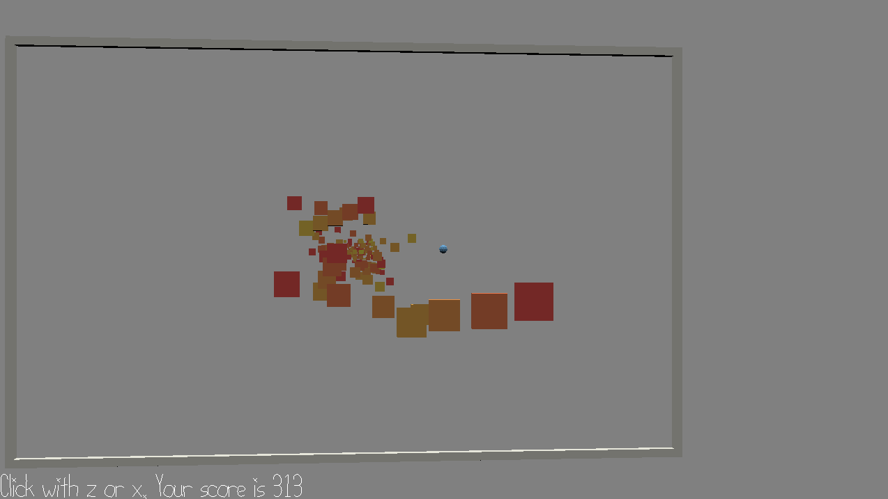

# Musical Squares

Author: Kevin You

Design: A rhythm game set in 3D perspective, where the player must rely on music to estimate the depth of tiles. Track consists of human selected time stamps and randomly generated locations. 

Screen Shot:

How To Play:

Use mouse to control view and z or x to click on squares as they approach the larger frame. A few plays may be necessary to get familiarized with the music. 

This game was built with [NEST](NEST.md).
